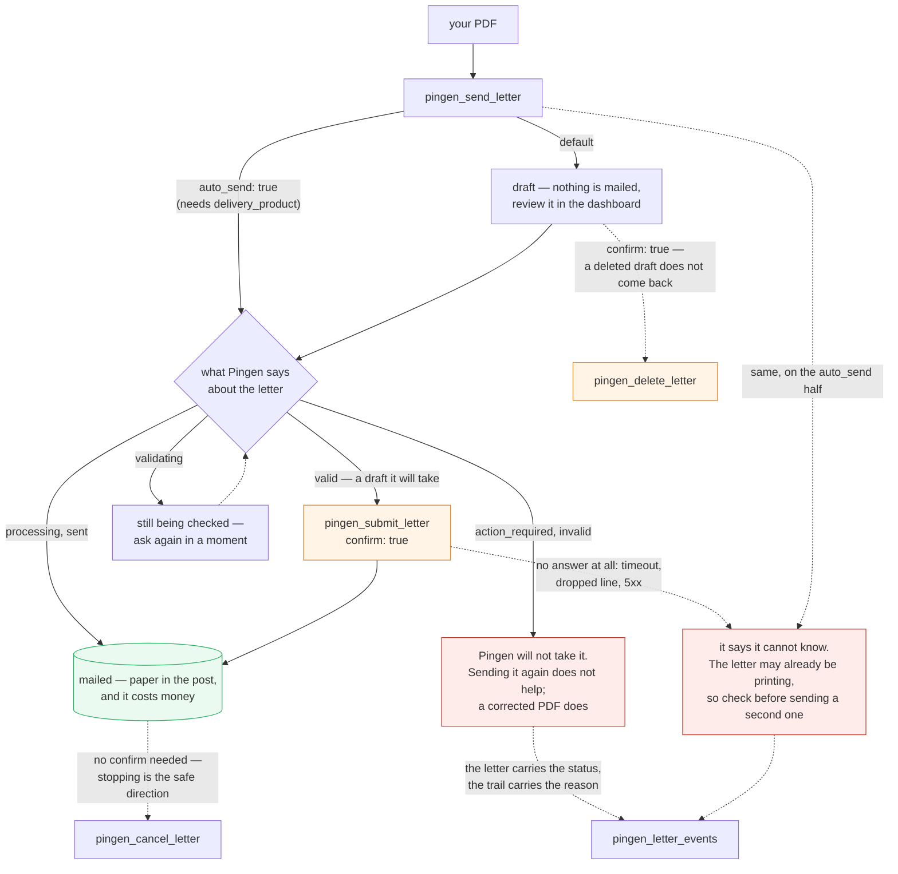

<div align="center">

# pingen-mcp

Send physical letters — A-Post, B-Post, registered — straight from a PDF via the **Pingen v2** API.

[](https://www.npmjs.com/package/pingen-mcp)
&nbsp;
[](https://github.com/sapn95/pingen-mcp/actions/workflows/ci.yml)
&nbsp;
[](https://nodejs.org)
&nbsp;
[](LICENSE)

</div>

---

MCP server for [Pingen v2](https://pingen.com) — send real, physical letters
(**A-Post / B-Post / registered / Einschreiben**) from a PDF and track them,
straight from any MCP client (Claude Code, Claude Desktop, …). It talks to the
official Pingen REST API — no browser automation. Pingen prints and mails the
letter for you; data is hosted in Switzerland.

**Credentials are never stored in this repo.** They are read at runtime from
the macOS login keychain (or from environment variables). Nothing secret is
committed.

---

## Prerequisites

- **Node.js ≥ 20.19** (`node --version`)
- A **Pingen account** with an **OAuth client** (`client_credentials` grant) — see below
- macOS (the credential lookup uses the `security` keychain tool; on other
  platforms use the environment-variable alternative instead)

```bash
git clone https://github.com/sapn95/pingen-mcp.git
cd pingen-mcp
npm install
```

---

## Credential setup (step by step)

This is the part that must be right, or nothing works. You need **three**
values from Pingen and you store them in the macOS keychain.

### 1. Create a Pingen account

Sign up at <https://app.pingen.com>. A free account is enough to create drafts
and test; you only pay when you actually mail a letter.

### 2. Create an OAuth client (to get Client-ID + Client-Secret)

1. In the Pingen dashboard open **Settings → API / Developer** (also reachable
   at <https://app.pingen.com/organisation> → **API**).
2. Create a new **OAuth client / application**.
3. Choose the **`client_credentials`** grant (machine-to-machine; no redirect
   URL, no user login at request time).
4. Copy the **Client-ID** and the **Client-Secret**. The secret is shown
   **only once** — copy it now.

### 3. Find your Organisation UUID

Each Pingen organisation has a UUID. It appears in the dashboard URL when the
organisation is selected (`https://app.pingen.com/.../organisations/<UUID>/...`),
or under **Settings → Organisation**. It is optional only when your account has exactly one
organisation: the server then calls `GET /organisations` and uses it. With
several, it refuses and lists them rather than deciding — silently — which
account pays for and franks the letter.

### 4. Store all three in the macOS keychain

Run these exactly (the service names must match what `index.js` reads). Replace
the angle-bracket placeholders with your real values:

`-w` without a value prompts instead of taking the secret from the command
line, so it never reaches your shell history or a process listing — where a
credential that can print and post mail at your expense has no business being.

```bash
security add-generic-password -a pingen -s pingen-mcp-client-id     -w -U   # prompts
security add-generic-password -a pingen -s pingen-mcp-client-secret -w -U   # prompts
# Optional — auto-detected from /organisations if you skip it, and only when
# the account has exactly one:
security add-generic-password -a pingen -s pingen-mcp-org-uuid      -w -U   # prompts
```

The exact service names read by `index.js` are:

| Value | Keychain service name | Env-var alternative |
| --- | --- | --- |
| Client-ID | `pingen-mcp-client-id` | `PINGEN_CLIENT_ID` |
| Client-Secret | `pingen-mcp-client-secret` | `PINGEN_CLIENT_SECRET` |
| Organisation UUID (optional) | `pingen-mcp-org-uuid` | `PINGEN_ORG_UUID` |

(`PINGEN_API_BASE` overrides the API base URL, default `https://api.pingen.com`.)

The organisation UUID is optional only where there is nothing to choose: it is
discovered automatically when the account has exactly one organisation, and
asked for otherwise. "Exactly one" means one in the account, not one on the page
that came back — an organisation list long enough to paginate is a question too,
because picking the first entry off it would decide, silently, which account pays
for and franks the letter.

An environment variable that is **set** always wins — even when it is empty. A
blank `PINGEN_CLIENT_SECRET` means *no secret*, not *go and look in the
keychain*; a blank `PINGEN_API_BASE` means *no endpoint*, not *use production*.
Only an entirely absent variable falls through to the keychain, so blanking one
is a reliable way to make sure a run cannot reach your real account.

Verify a value is stored (prints the value to your terminal — run only when
you're OK seeing it):

```bash
security find-generic-password -a pingen -s pingen-mcp-client-id -w
```

> The first time the server reads the keychain, macOS may pop up
> *"node wants to use your confidential information"*. Click **Always Allow**
> so it doesn't prompt on every start.

**Never commit credentials.** The `.gitignore` already excludes `.env` files;
the keychain path keeps secrets out of the filesystem entirely.

---

## Register in Claude Code

```bash
claude mcp add pingen --scope user -- node /absolute/path/to/pingen-mcp/index.js
```

That writes an entry into `~/.claude.json`. Equivalent manual snippet:

```json
{
  "mcpServers": {
    "pingen": {
      "command": "node",
      "args": ["/absolute/path/to/pingen-mcp/index.js"]
    }
  }
}
```

Then, in a Claude Code session, run `pingen_status` — it should print your
organisation. That confirms the credentials and registration are correct.

For **Claude Desktop**, add the same `mcpServers` block to
`~/Library/Application Support/Claude/claude_desktop_config.json`.

---

## Draft-vs-send safety model (read this)

Sending a letter is **two explicit steps**, so you never mail something by
accident:

1. **`pingen_send_letter`** uploads the PDF and creates a **DRAFT**
   (`auto_send = false`). **Nothing is mailed.** You can review it in the Pingen
   dashboard.
2. **`pingen_submit_letter`** takes an existing draft and **physically mails
   it**. This is the step that costs money and puts paper in the post, so it
   needs `confirm: true`. `pingen_delete_letter` needs the same, because a
   deleted draft does not come back. `pingen_cancel_letter` does not: stopping
   a letter is the safe direction.



The only shortcut is passing `auto_send: true` to `pingen_send_letter`, which
mails immediately without a review step — use deliberately. It also requires
`delivery_product`: the product is optional on a draft only because
`pingen_submit_letter` asks for one later, and `auto_send: true` is the single
route that never reaches that call.

A draft must reach status **`valid`** before it can be submitted. If Pingen
still needs something (e.g. the address couldn't be read), the draft is
`action_required` and submit will fail — see *Troubleshooting*. `pingen_send_letter`
says so on the spot: a letter that comes back `action_required` or `invalid` is
reported as a draft Pingen will **not** take, with the status and where to look,
and not with the usual "now submit it" — on **both** of its halves, the draft one
and `auto_send: true`, because a refused PDF is refused either way and the half
that was told to mail it is the half most likely to be told to try again.
`pingen_submit_letter` says the same thing about the same two statuses rather
than "try again": a letter Pingen has refused does not become sendable by being
sent a second time, and the note names the one step that helps — a corrected PDF.

All three of those notes point at **`pingen_letter_events`** for the reason,
because that is where Pingen keeps it: the letter itself carries the status and
nothing about why, while the trail carries a bare code (`layout_unsupported_format`
and the like). `pingen_get_letter` cannot answer that question — it returns the
letter row — so being sent there is being told to look somewhere the answer has
never been.

All of that reads an answer. The two calls that put paper in the post also say
what they do **not** know when there is no answer to read: a timeout, a dropped
connection, a body that stopped halfway. Pingen may well have taken the letter
before the line went dead, so a bare *"the request failed"* — which is what a
retry gets triggered by — would be a guess in the direction of a second letter,
printed and charged. Instead the error says the letter may be on its way and
names the tool that can settle it: `pingen_get_letter` after a submit, where the
id is in hand, and `pingen_list_letters` after an `auto_send: true` create, where
it is not, because the id was in the answer that went missing.

Two things — and only two — take that warning off again, because a warning worth
ignoring is worth nothing. Pingen answering for itself takes it off: a 404, a
`conflict_state`, anything below 500 says the request was stopped and no paper
moved. Never having sent the request takes it off too, in the same direction:
a missing client secret or a refused token grant is a failure this server
reaches on its own, with the line to Pingen never opened, and *"Keine
Pingen-Credentials"* used to come back with a paragraph about a letter that
might be printing. Everything else is genuinely unknown and keeps the warning —
including a **`502`, `503` or `504`**, which look like an answer and are not:
those are written by whatever sits in front of the API saying it could not get
one back, which covers the letter already on the press exactly as well as the
letter that never existed.

---

## Tool reference

| Tool | Parameters | What it does / returns |
| --- | --- | --- |
| `pingen_status` | — | Verifies credentials; returns your organisations (`id`, `name`, `plan`, `status`) and the active org id. That list paginates too: if it is only a page, the result says `truncated: true`, and a configured `PINGEN_ORG_UUID` that is simply not on that page is no longer announced as belonging to no reachable organisation. |
| `pingen_list_letters` | `limit` (number, 1–100, default 20) | Lists recent letters, newest first: `id`, `status`, `delivery_product`, `recipient`, `tracking`, `pages`, `submitted`, `price`. One page only: if Pingen has more, the result also carries `truncated: true` — so *"nothing went to that address"* is never concluded from a list that was never read to the end. |
| `pingen_send_letter` | `file_path` (required, absolute PDF path); `delivery_product` (optional for a draft, **required with `auto_send: true`**); `address_position` (`left`\|`right`, default `left`); `auto_send` (bool, default `false`) | Uploads the PDF and creates a letter. **DRAFT by default — nothing is mailed.** Returns the created letter row plus a note. Set `auto_send: true` to mail immediately; without a `delivery_product` that call is refused before anything is uploaded, because nothing asks for a product later and the letter would be franked however Pingen falls back. The note is decided by the status Pingen answered with and not by the flag that was sent, so a letter Pingen has already taken for printing is never reported as one still sitting there — and a status this server does not recognise, or an answer carrying none, is reported as unknown in both directions — neither as a send nor as "not a draft", because guessing the second shuts the two-step flow down just as confidently as guessing the first opens it. A resting status is not one answer either: `action_required` and `invalid` are Pingen refusing the PDF, so those are reported as a draft it will not take rather than as one waiting to be submitted — on both halves of the note, `auto_send: true` included, where "NICHT versandt" alone left the refusal unsaid and a second attempt looking sensible. The reason is named where it lives: `pingen_letter_events`. And when the `auto_send: true` call gets no answer at all — a timeout, a dead connection, or a `502`/`503`/`504` from a gateway that could not get one back either — the error says so rather than reading as a call that never arrived: the letter may already have been created and taken for printing, so it names `pingen_list_letters` for the check and warns against uploading the same PDF again. |
| `pingen_submit_letter` | `letter_id` (required); `delivery_product` (required); **`confirm: true` (required)**; `print_mode` (`simplex`\|`duplex`, default `simplex`); `print_spectrum` (`color`\|`grayscale`, default `color`) | **Physically mails an existing draft, at your cost, with no undo.** Requires the letter to be `valid`. The result is decided by the status that came back rather than by the call having been accepted: only when Pingen says it has taken the letter is the row filed under `submitted`; otherwise it comes back as `letter` with a note saying so, so Pingen answering 200 while leaving it in `action_required` is reported as **not** on its way, and a status this server does not recognise — or none at all — is reported as unknown rather than as a send. Not every "still here" is the same either: `action_required` and `invalid` are Pingen refusing the PDF, so the note says a second attempt will not move the letter, points at `pingen_letter_events` for the reason and at a corrected PDF for the fix, while `draft` and `valid` still say to check the cause and send again. A failure with no answer behind it is not reported as a letter that stayed put either: Pingen may have taken it before the connection died, so the error points at `pingen_get_letter` and against a blind second send — and a `5xx` counts as no answer, because it is a gateway or a broken handler saying so rather than Pingen saying what happened. What does *not* get that warning is a failure that settles the question: a status below 500, and a failure this server hit *before* the request went out — no credentials, a refused grant, an empty base. A connection that died once the request had left is not one of those, and keeps the warning: at the point where it reads `fetch failed`, a socket that was never opened and a socket that was closed after the letter reached the press look identical. |
| `pingen_get_letter` | `letter_id` (required) | Status/tracking of one letter (single letter row). |
| `pingen_cancel_letter` | `letter_id` (required) | Cancels an already-submitted/sent letter where Pingen still allows it. Returns `{ cancelled: <id> }`. |
| `pingen_delete_letter` | `letter_id` (required); **`confirm: true` (required)** | Deletes a draft / not-yet-sent letter for good. To stop a letter already on its way use `pingen_cancel_letter`. Returns `{ deleted: <id> }`. |
| `pingen_letter_events` | `letter_id` (required) | Tracking/status history (created → submitted → sent → delivered → undeliverable …): `type`, `at`, `detail`. First page only, newest first; `truncated: true` when Pingen reports more — and also when it reports nothing at all and the page came back exactly full, which is the last evidence available that the trail was cut off. So a letter that is still moving is never read as one that has stopped. |
| `pingen_download_letter` | `letter_id` (required); `output_path` (required) | Downloads the final letter PDF to `output_path` (available once processed/sent). Returns `{ saved, bytes }`. Pingen answers this either with the letter's bytes or with a pointer to them, and which of the two it is, is decided by the body rather than by the `Content-Type` — a media type is case-insensitive, and an answer that carries none at all is defined to mean `application/octet-stream`, so reading the header literally turned a perfectly good letter into `Unexpected token '%'`. Nothing is written that does not start with `%PDF-`: a bucket answering an expired link with XML, or a portal answering with its sign-in page, is reported rather than saved under the name of a letter. |

### Example

```jsonc
// 1) create a DRAFT (nothing mailed yet)
pingen_send_letter { "file_path": "/Users/me/Einsprache_2024.pdf", "delivery_product": "registered", "address_position": "left" }
// → { created: { id: "<letter_id>", status: "draft", … },
//     note: "DRAFT erstellt (nichts versandt). Zum Senden: pingen_submit_letter." }

// 2) review in the Pingen dashboard, then physically mail it
pingen_submit_letter { "letter_id": "<letter_id>", "delivery_product": "registered", "print_mode": "duplex", "print_spectrum": "grayscale", "confirm": true }
```

---

## Delivery products & print options (Switzerland)

Pass `delivery_product` to `pingen_send_letter` / `pingen_submit_letter`:

| Value | Swiss product | Notes |
| --- | --- | --- |
| `cheap` | **B-Post** | economy, slower |
| `fast` | **A-Post** | priority, next-day where available |
| `registered` | **Einschreiben** | tracked + signed-for delivery |
| `premium` | priority/premium | availability depends on plan |

Print options on `pingen_submit_letter`:

- `print_mode`: `simplex` (single-sided, default) or `duplex` (double-sided)
- `print_spectrum`: `color` (default) or `grayscale`

Exact product availability depends on your organisation/plan — check the Pingen
dashboard.

---

## PDF layout gotcha (make your letters pass validation)

Pingen reads the recipient address optically from the **first page** and reserves
a franking zone. If your PDF doesn't respect the Swiss letter window, Pingen
returns `action_required` with `protected_stamp_area` and the letter can't be
submitted. To pass validation:

- **Recipient address inside the address window.** For `address_position: left`
  the window sits roughly **from 60 mm down from the top**, left column starting
  **~22 mm** from the left edge. Put the full recipient block there.
- **Keep the franking zone (top ~40–60 mm) blank.** No logo, no text, no line in
  the top strip — that area is reserved for the stamp/frank.
- **Do not put a sender return line inside the window.** A return address in the
  same window confuses address recognition — keep **only the recipient** in the
  window (a sender line, if any, belongs above/outside it).

If in doubt, create a draft with `pingen_send_letter`, open it in the dashboard,
and check the address preview before submitting.

---

## Troubleshooting

| Symptom | Cause | Fix |
| --- | --- | --- |
| `action_required` / `protected_stamp_area` | Address outside the window, or something in the franking zone / a sender line inside the window | Reposition the recipient into the address window and clear the top ~40–60 mm (see *PDF layout gotcha*), re-upload. Which of them it was is on the letter's trail, not on the letter: `pingen_letter_events` shows the code Pingen rejected it with. |
| `conflict_state` when submitting | The letter isn't `valid` yet (still a draft that needs work) | Fix the address issue so the draft reaches `valid`, then call `pingen_submit_letter`. Check state with `pingen_get_letter`. |
| `Keine Pingen-Credentials …` / empty keychain | The `security` lookup returned nothing | Re-run the `security add-generic-password` commands with the exact service names, then verify with `security find-generic-password -a pingen -s pingen-mcp-client-id -w`. |
| Token error (401/400 on `/auth/access-tokens`) | Wrong Client-ID/Secret, or the OAuth client isn't a `client_credentials` client | Recreate the OAuth client with the `client_credentials` grant and re-store the values. |
| `fetch failed` / `Zeitüberschreitung` / `502`, `503`, `504` on send or submit | The request left, a usable answer did not — Pingen may have taken the letter anyway. A gateway status is not Pingen's answer, it is the box in front saying it could not get one | Do **not** repeat the call. Check first: `pingen_get_letter` for a submit, `pingen_list_letters` (newest first) for an `auto_send: true` create. Only then decide. |
| Keychain prompt on every start | macOS didn't remember the access grant | On the popup click **Always Allow** for `node`. |

---

## Releasing

Published from CI with **npm Trusted Publishing** (OIDC) — there is no npm token
anywhere: no secret to store, rotate or leak. npm recommends this over an
automation token, and is restricting tokens that bypass 2FA.

One-time setup per package, on npmjs.com -> the package -> Settings ->
Trusted Publisher:

| Field | Value |
| --- | --- |
| Organization or user | sapn95 |
| Repository | pingen-mcp |
| Workflow filename | release.yml |
| Allowed actions | npm publish |

The workflow filename must match exactly. That is deliberate: it stops any other
workflow in the repo from publishing under your name.

Then every release is one command:

    npm version patch && git push --follow-tags

The tag triggers the release workflow: it upgrades npm (trusted publishing needs
>= 11.5.1 and Node >= 22.14), refuses a tag whose version disagrees with
package.json, runs the gate, and publishes with a signed provenance statement.

### If the publish fails with 404

    npm notice publish Signed provenance statement ... from GitHub Actions
    npm error 404 Not Found - PUT https://registry.npmjs.org/pingen-mcp

Provenance was signed, so OIDC worked — the registry simply does not accept this
workflow as a publisher yet. That means the **trusted publisher is not configured**,
or the repository / workflow name does not match. npm answers 404 rather than 403
so as not to reveal whether the package exists. It is not a credential problem:
there is no credential, by design.

## Checks

    npm run gate
    npm run mutate    # mutation-test the lines this branch changed

Runs exactly what CI runs, offline and without credentials: a syntax check,
ESLint, the protocol smoke test, the hygiene scan, and the test suite under
coverage. `npm test` runs just the suite, `npm run lint` just the linter.

The smoke test completes the MCP handshake over stdio and asserts the things that
have actually broken here — a server version drifting from package.json, a tool
in the dispatcher but missing from the tool list (or advertised and unhandled), a
required property absent from a schema, and descriptions too thin to choose a
tool from. The hygiene scan refuses secrets, tracked session files and personal
identifiers.

The suite in `test/` drives the server over stdio exactly as a real MCP client
does, against a local stand-in for `api.pingen.com` (`test/mock-pingen.mjs`) that
listens on an ephemeral port. Credentials are fake, `PINGEN_API_BASE` points at
the mock, and a `security` stub that finds nothing goes first on `PATH`: **no
test can reach the real API, the real login keychain, or the post**. Alongside
the happy paths it pins the properties that matter — that `pingen_send_letter`
creates a draft and submits nothing, that a non-boolean `auto_send` still yields
a draft, that neither of the two calls that reach the post will do so without a
`delivery_product`, that neither of them reports a send Pingen did not confirm —
in the note or in the key the letter is filed under — that a draft Pingen has
flagged is never announced as ready to post and never answered with an
instruction to send it again, by any of the three branches that see that status
— the two halves of `pingen_send_letter` and `pingen_submit_letter` — that each
of them names a tool that can actually say why the letter was refused, that
neither of the two calls that mail reports a request Pingen never answered as a
letter that stayed put — whether the answer was silence or a gateway's `502` —
while the two failures that do settle the question are left alone, a status
Pingen wrote itself and a request that was never sent, that
submitting is a `PATCH`, and that no token or client secret can
appear in a tool result or on stderr even when the upstream error body quotes it
back. The gate fails below 90% line, 90% function and 80% branch coverage of
`index.js`.

`test/hygiene.test.mjs` points the hygiene scan at throwaway git repositories
instead, because run over this repository — where everything is clean — a scan
that silently skipped half the files would look exactly like one that worked.

### Mutation testing

`npm run mutate` asks a different question from everything above: not "do the
tests pass" but "would they notice if a guard were removed". StrykerJS deletes
one piece of behaviour at a time and reruns the suite; whatever survives is
something no assertion is watching.

That found eleven real gaps here after the model review rounds had stopped
turning anything up — among them a path that walked out of the letters
collection, a warning that went missing at exactly one HTTP status, and a page
of one organisation being read as an account with one organisation. Most of the
fixes were to the fixture rather than the code: a stand-in that accepts more
than the real server does is a stand-in that hides the difference.

There is no browser in this suite, so `npm run mutate:all` over the whole file
is about forty minutes and worth running. `stryker.config.json` explains every
setting that is not a default — including why incremental mode is off, and why
the number to watch when tuning it is the timeout count rather than the score.

## License

MIT — see [LICENSE](LICENSE).
